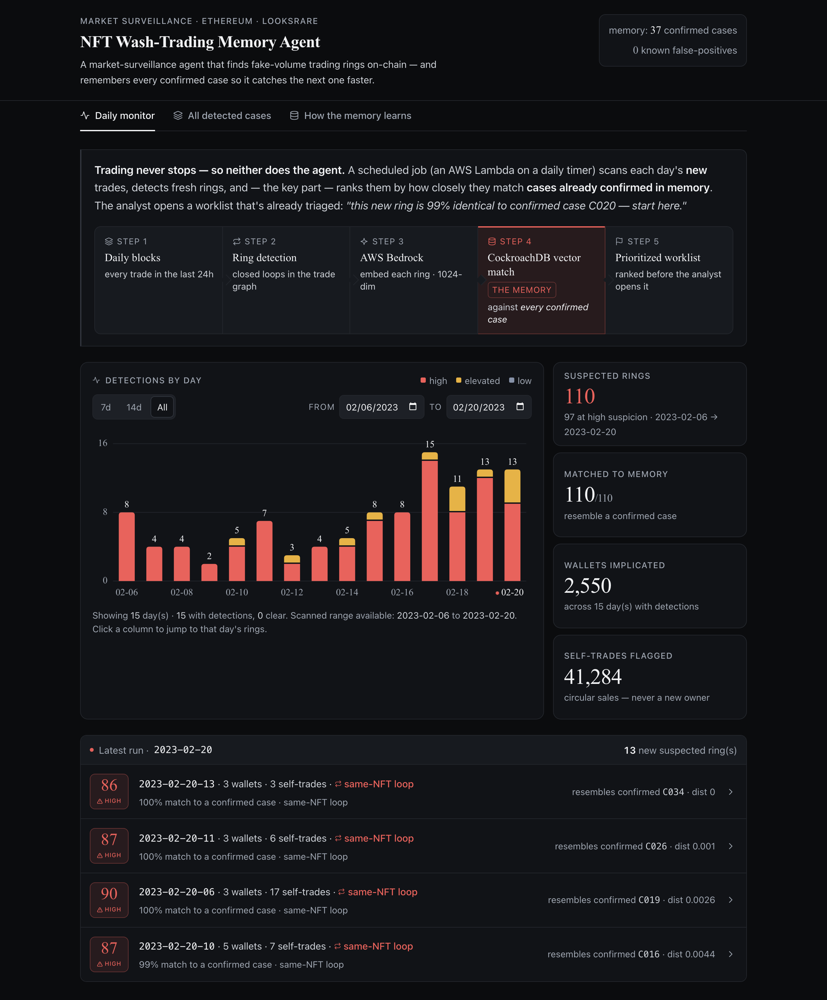
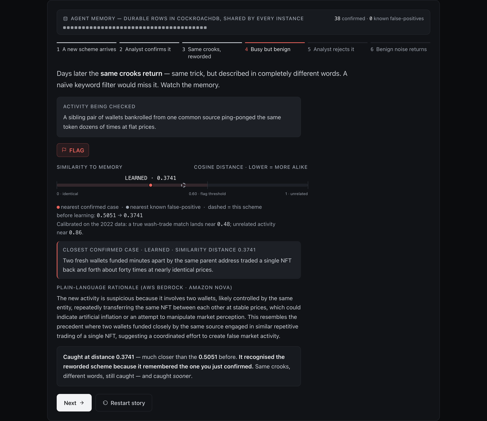
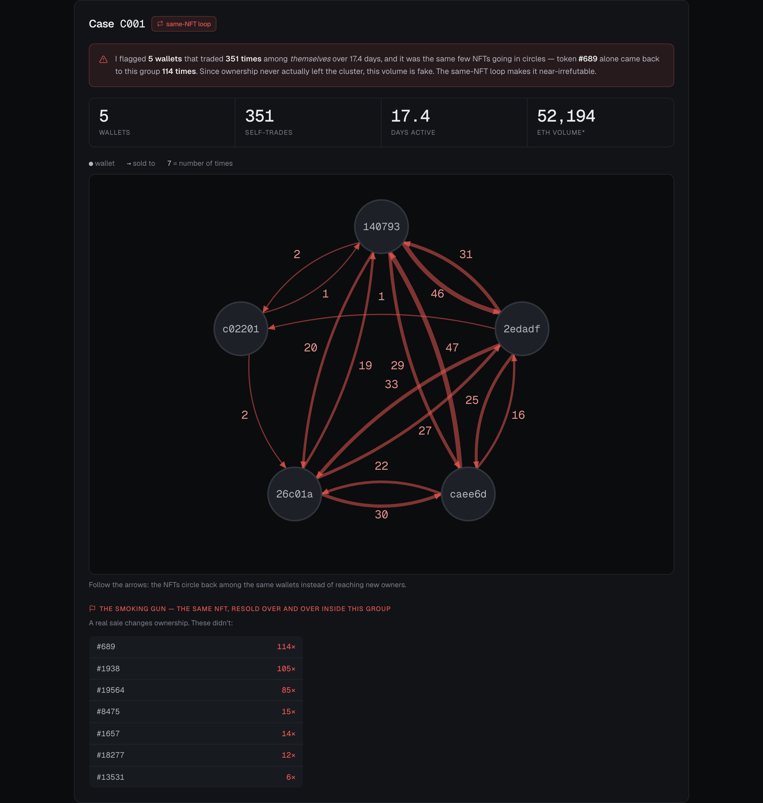
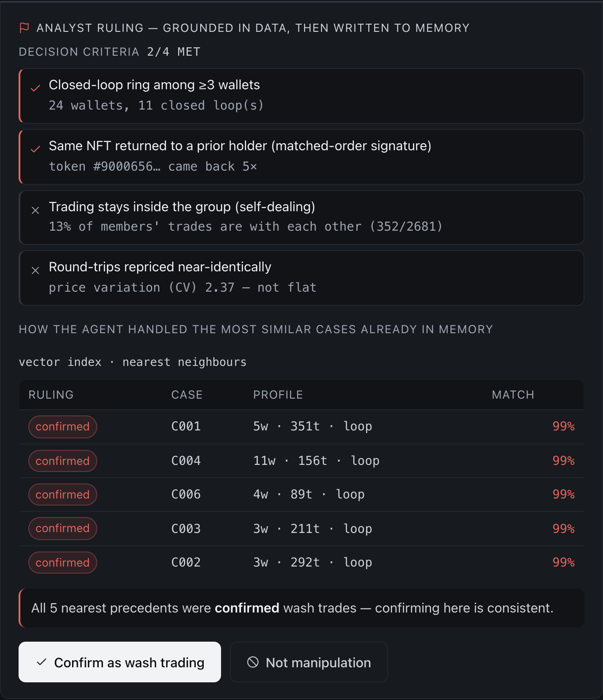
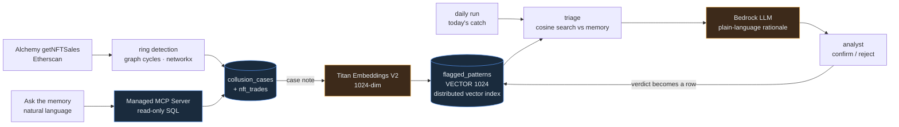

# NFT Wash-Trading Memory Agent

A memory-driven agent that detects NFT wash trading and **learns to catch it earlier over time**. When a wash-trading wallet pair is confirmed, the agent doesn't just log the pattern — it traces back through the wallet's full history to mine the *earliest precursor signals* that preceded the obvious round-tripping, and stores them as a growing **playbook** in CockroachDB. Each confirmed case makes the next detection earlier and sharper.

Built for the **CockroachDB × AWS "Build with Agentic Memory" hackathon**.

**🔴 Live demo:** [nft-wash-trading-nu.vercel.app](https://nft-wash-trading-nu.vercel.app) — public, read-only (no write access, no AWS keys — see *Public demo mode* below).
**🎥 Demo video:** [youtu.be/5o7yhh2lGls](https://youtu.be/5o7yhh2lGls) — "Catching NFT Wash Trading with Agentic Memory"

> **Data & scope:** Public on-chain data only (Dune Analytics `nft.trades` + Etherscan). Target: LooksRare / Ethereum / 2022, where independent research (Niu et al., 2024) estimated ~94.5% of volume was wash trading. No proprietary or exchange-internal data or methodology is used.

---

## The demo

Run it yourself:

```bash
uvicorn app.main:app --port 8100     # then open http://localhost:8100
```

Or use the [live public deployment](https://nft-wash-trading-nu.vercel.app) — see *Public demo mode* below for what that deployment can and can't do.

### 1. Daily monitor — the analyst's morning worklist

A scheduled run scans each day's new trades, detects fresh rings, and ranks them by how closely
they match **cases already confirmed in memory**. Across 15 consecutive scanned days, **all 110
detected rings resembled a confirmed case** — so the analyst opens a worklist that is already
triaged. Pick a range with the presets or the date fields; click a column to jump to that day.



### 2. The memory getting sharper — the whole point

An analyst confirms a scheme; the agent writes it to CockroachDB. Days later the **same crooks
return, worded completely differently** — a keyword filter would miss it. The distance meter shows
what memory bought: the same scheme moved from **0.5051 → 0.3741** cosine distance. Caught, and
caught *sooner*.



### 3. Evidence per case — why this is not a guess

Case C001: 5 wallets, 351 trades among *themselves*, and token **#689 came back to the group 114
times**. A genuine sale moves an NFT to a new owner; these loops never do. Press **Replay** to
watch the ring form trade by trade in block order — the real on-chain sequence, not an animation.



### 4. The ruling, not just a flag

Confirming a ring isn't a bare button. Every ruling shows a **decision checklist computed from
that ring's own trades** (met 2/4 here — the honest miss is left visible, not hidden) and the
**five closest precedents already in memory**, all confirmed, so the verdict is grounded and
consistent with what came before.



---

## Public demo mode

The [live deployment](https://nft-wash-trading-nu.vercel.app) connects with a **read-only**
CockroachDB user and ships **no AWS credentials**, so it can't spend money and can't write —
by construction, not just by convention. Two layers back this up:

1. **Database-level:** `demo_ro` has `SELECT` only. Verified directly: `INSERT`/`UPDATE`/`DELETE`
   against it all fail with a permission error, even if application code had a bug.
2. **Application-level:** with no `AWS_ACCESS_KEY_ID` present, [`app/demo.py`](app/demo.py) flips
   `demo.ENABLED` on automatically. Every Bedrock-backed response (triage, rulings, "Ask the
   memory") is replayed from [`app/demo_data.json`](app/demo_data.json) — a snapshot of one real
   run against the live cluster and live Bedrock (`python -m src.make_demo_snapshot`), not
   fabricated. Confirm/reject verdicts are shown but not persisted.

**What's genuinely live in the demo:** every detected case, wallet, ring graph, and the daily-run
history — all queried from CockroachDB in real time. **What's replayed:** AI-generated rationales
and the scripted "memory learns" walkthrough. Run it locally with your own keys (see *Setup*
below) for the full read-write loop.

---

## What's actually running

Against a live CockroachDB Cloud cluster, on real 2022 LooksRare data:

| | |
|---|---|
| Trades ingested (`nft_trades`) | **83,901** |
| Daily detection runs (2023-02-06 → 02-20) | **15 consecutive days** |
| Collusion cases detected (`collusion_cases`) | **147** (37 base + 110 from daily runs) |
| Daily-run rings that matched a confirmed case | **110 / 110** |
| Playbook patterns in vector memory (`flagged_patterns`) | **37** |
| Distributed vector index | `flagged_patterns_embedding_idx` — **live** |
| Embeddings | AWS Bedrock Titan Text Embeddings V2, 1024-dim — **live** |
| Flag rationales | AWS Bedrock chat model — **live** |

---

## How it works (pipeline)

1. **Ingest** LooksRare 2022 trades from Dune → CockroachDB.
2. **Confirm** wash-trading pairs via a symmetric round-trip heuristic (pairs trade back-and-forth near-identical counts in each direction) + funding-relationship checks on Etherscan.
3. **Mine precursors**: for each confirmed pair, pull full wallet history and engineer early-signal features (time from first funding → first trade, funding-source diversity, counterparty concentration).
4. **Learn** which precursors best predict eventual confirmation (AWS SageMaker), turn the top signals into playbook entries.
5. **Remember**: embed playbook entries (AWS Bedrock) into CockroachDB's vector index.
6. **Detect** new activity via vector similarity + rule thresholds; the agent flags with a human-readable explanation citing the closest known precedent.
7. **Close the loop**: human approve/reject is written back to CockroachDB — the memory that makes the agent better over time.

## CockroachDB tools used
- **Distributed Vector Indexing** — **live.** `VECTOR(1024)` column + C-SPANN index on
  `flagged_patterns`; every triage is a similarity search against it. See [`sql/schema.sql`](sql/schema.sql).
- **Durable agent memory** — **live.** `confirm()` / `reject()` verdicts are rows, not session
  state, so the improvement survives restarts and is shared by every agent instance.
- **Cloud Managed MCP Server** — **live.** The "Ask the memory" panel answers analyst questions in
  plain English: the agent reads the schema and runs a read-only `select_query` over the managed MCP
  endpoint, then shows the SQL it generated. It never opens its own SQL connection for this path and
  holds no write credentials — [`src/crdb_mcp.py`](src/crdb_mcp.py) refuses any tool outside a
  read-only allowlist, because a Cluster Admin key *can* otherwise call `insert_rows`.
  Accuracy is checked against hand-written truth queries: `python -m src.eval_ask` (8/8).
- **ccloud CLI** — _(stretch)_ cluster provisioning/backup shown in the demo.

## AWS services used
- **Bedrock — Titan Text Embeddings V2** — **live.** Embeds every playbook entry and every piece of
  incoming activity into the 1024-dim space the vector index searches.
- **Bedrock — chat model** — **live.** Writes the plain-language rationale citing the closest
  precedent. Defaults to Claude Haiku 4.5; see *Bedrock model access* below.
- **Lambda** — _(planned)_ the daily timer that drives `src/daily_run.py` in production.
- **SageMaker** — _(planned)_ trains the precursor-signal model, extracts feature importance.
- **S3** — _(planned)_ raw-response / audit archival.

### Bedrock model access

Claude on Bedrock requires a one-time **"Anthropic use case details"** form per AWS account
(Bedrock console → *Model access*). Until it's approved the account gets
`ResourceNotFoundException`, so `src/bedrock.py` automatically falls back to another Bedrock model
and the UI labels the rationale with **whichever model actually produced it** — the demo never
shows an empty box. Override either model with `BEDROCK_CHAT_MODEL` /
`BEDROCK_FALLBACK_CHAT_MODEL`.

---

## Setup

Requires Python 3.11+.

```bash
python3 -m venv .venv
source .venv/bin/activate
pip install -r requirements.txt

cp .env.example .env       # then fill in your real DUNE_API_KEY and ETHERSCAN_API_KEY
```

Then set up the cluster and load data:

```bash
python -m src.crdb_init          # create schema + the distributed vector index
python -m src.crdb_load          # load trades into CockroachDB
python -m src.ring_detect        # find closed-loop trading rings -> collusion_cases
python -m src.build_playbook     # embed confirmed cases via Bedrock -> vector memory
python -m src.daily_run --date 2023-02-16   # one "today's catch" run
```

## Run (Milestone 1 — local signal pipeline)

```bash
# 1. Pull the top candidate pairs from Dune (LooksRare 2022).
#    If you created the query in the Dune UI from sql/top_pairs.sql:
python -m src.dune_pull --query-id <your_query_id>
#    Or attempt programmatic creation from the .sql file:
python -m src.dune_pull --sql sql/top_pairs.sql --name "top pairs"

# 2. Score pairs by round-trip symmetry and flag wash-trade candidates.
python -m src.pair_heuristic

# 3. Trace each candidate wallet's funding history via Etherscan.
python -m src.etherscan_trace
```

Outputs land in `data/raw/` (raw pulls) and `data/processed/` (scored pairs, wallet features).

## Architecture

The point of the design: **the evidence and the memory live in the same database.** A ring is
detected from trades, written as a case, embedded, and searched against every past verdict —
without syncing a relational store to a separate vector store.



<sub>Blue = CockroachDB Cloud · Amber = AWS Bedrock</sub>

**The loop that matters** is the dashed line: every analyst verdict becomes a row in
`flagged_patterns`, so the next triage searches a larger, sharper memory — and because it is
matched by embedding rather than keywords, the same scheme is caught even when it is described in
completely different words.

## License

MIT — see [LICENSE](LICENSE).
